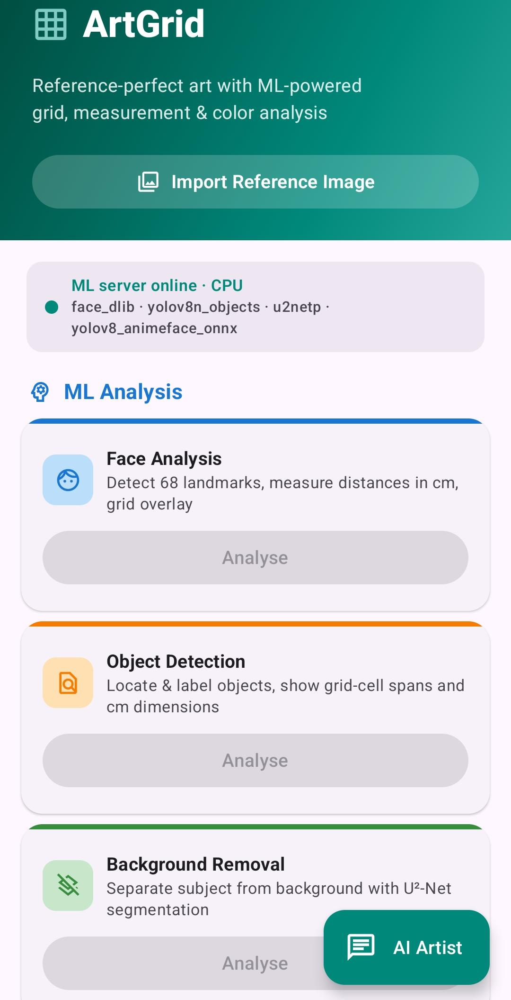
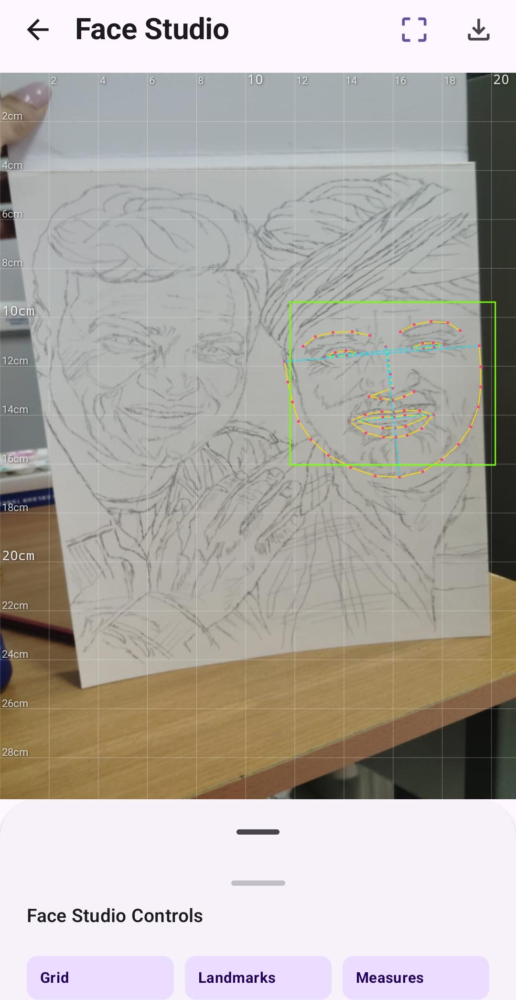
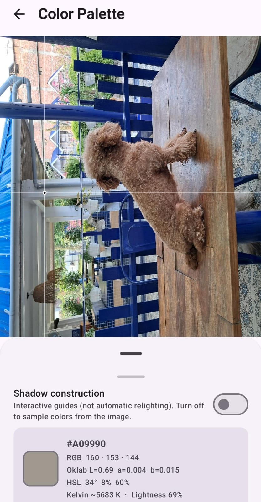
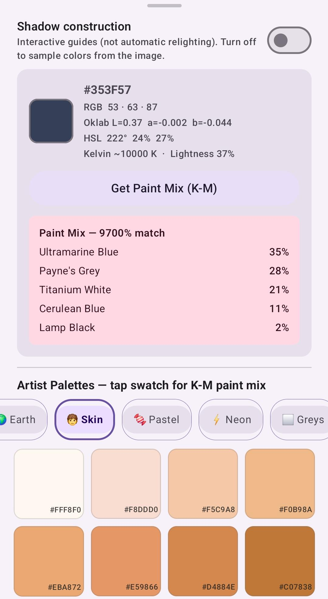
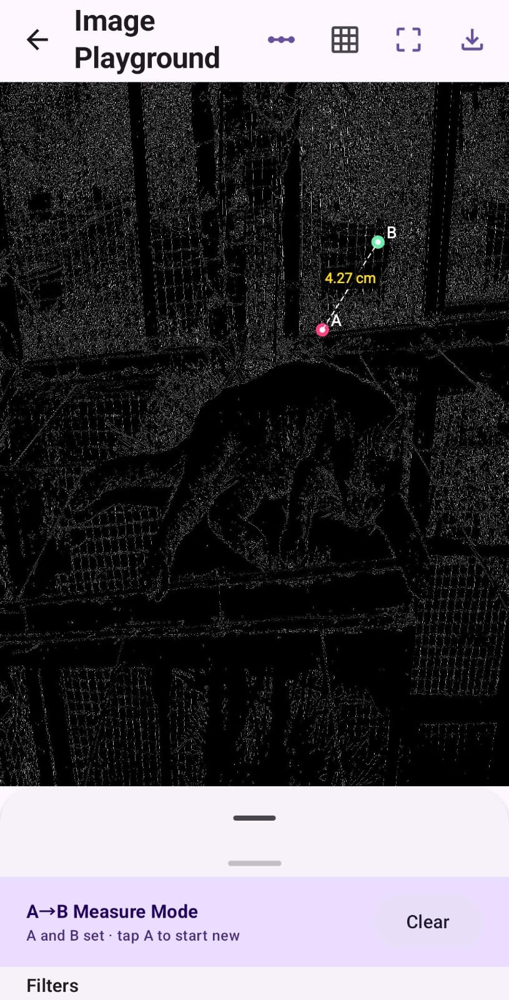
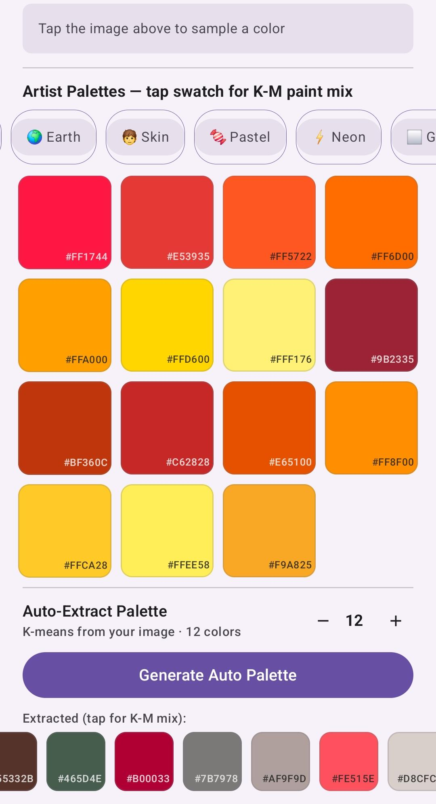
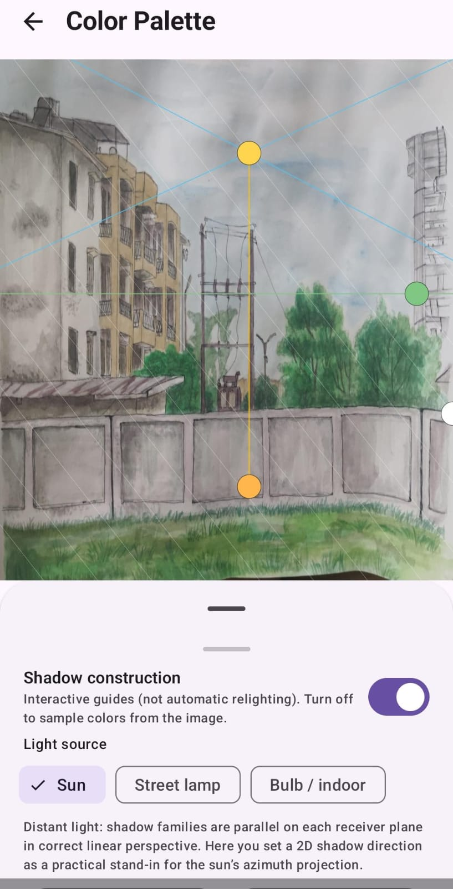
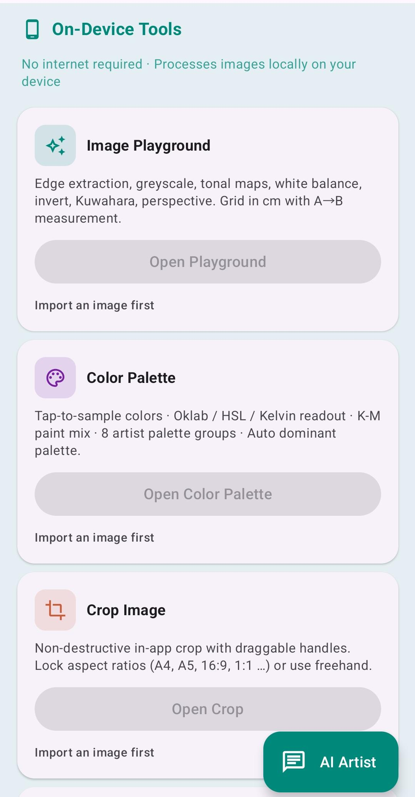
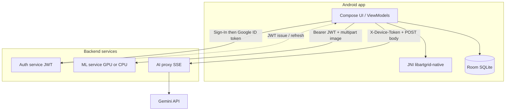

# ArtGrid

<div align="center">

### Computer Vision–Assisted Spatial Mapping Mobile Application for Digital-to-Physical Proportional Scaling

</div>

**ArtGrid** is a **mobile application** that replaces a traditional static drawing grid with something smarter and more interactive. Think of it as a **digital proportional divider**: instead of guessing spacing on paper, you work from a **reference photo**. **Machine learning models** on the backend find **structural landmarks** (eyes, nose, chin, outlines, detected objects and subject masks depending on which tool you use). The app then helps you turn **pixel distances on the reference** into **real-world centimeter measurements** for a **specific physical canvas**—for example A4, A3 etc—using **shared canvas calibration**, grids, paper mapping and native geometry tools.

Behind that artist-facing idea sits a **full-stack** setup: **on-device C++ image processing** (JNI) combined with **cloud ML** (face landmarks, **unified** human + stylised face fusion, object detection, U²-Net segmentation) and an **SSE-streamed** “AI Artist” chatbot through a backend proxy backed by Gemini. You analyse references in the cloud when you need ML, then refine edges, colour, lighting and layout **on the phone** without a round-trip for every tweak.

**Important:** The **ML models themselves run on the backend** (loaded from `Backend/models/` in Docker; see **[Technical documentation](App/docs/TECHNICAL%20DOCUMENTATION.md)**). The Android app talks to that service; it does not bundle the heavy ONNX/dlib weights.

<p align="center">
  <a href="https://github.com/yogitaranwa/ArtGrid">⭐ Star this repo</a>
  &nbsp;·&nbsp;
  <a href="https://github.com/yogitaranwa/ArtGrid/releases">Download APK</a>
  &nbsp;·&nbsp;
  <a href="https://github.com/yogitaranwa/ArtGrid/issues">Report an issue</a>
</p>

## Problem

Turning a **reference on screen** into accurate **marks on real paper** usually means fixed grids, rulers and guesswork. You measure pixels by eye, mentally rescale to A4 or A3 and lose alignment between **what the photo shows** and **what your hand draws**—especially for faces, figures and structured scenes.

**Digital and physical scale stay disconnected.**

## Solution

**ArtGrid** bridges that gap with **computer vision on the backend** (landmarks, detection, segmentation), **native geometry** on the phone (edges, calibration, colour math) and **explicit paper mapping** so **pixel distances become centimetre‑faithful overlays** on the canvas size you choose—without treating every edit as another round-trip to the server.

| Layer | Stack |
|-------|--------|
| **Mobile** | Kotlin 2.0, Jetpack Compose (Material 3), Hilt, Room, OkHttp/Retrofit, NDK |
| **Backend** | **Auth** (Go), **ML** (Python FastAPI), **AI proxy** (Go)—independently deployable |

---

## Overview

- **Reference-first workflow:** import an image, call the ML service when it is healthy, then use playgrounds and native filters locally so every small edit does not hit the network.
- **Hybrid compute:** heavy geometry and colour math runs **on-device**; face, object, and segmentation inference runs on the **ML service**; chat streams through the **AI proxy** (the phone does not call Gemini directly).
- **Production-ready paths:** OAuth/JWT auth, optional Cloud SQL, GPU ML on RunPod or similar, HTTPS endpoints wired via `demo.properties` / `BuildConfig` (see [Technical documentation](App/docs/TECHNICAL%20DOCUMENTATION.md)).

---

## Key features

### Core experience

- **Import & hub** — reference picker, ML health from Home, navigation across tools.
- **Server ML** — legacy single-face landmarks, **unified** human + anime-style face fusion, **YOLO** object locator, **U²-Net** subject/background segmentation.
- **Image playground** — native pipelines (edges, perspective, tonal tools, etc.) plus **shared canvas calibration** (cm grid) on key screens.
- **Colour & lighting** — sampling, palettes, **Kubelka–Munk**-style mix insights, **shadow geometry** overlay.
- **Practical studio tools** — crop, **paper / canvas size mapping**, **trace mode** (camera underlay), **reference history**, **progression comparator** (Room).

### Technical highlights

- **JNI native core** — Oklab-centred pipelines, perspective, Chamfer sampling, palette quantisation (`libartgrid-native`).
- **Dual auth models** — **JWT** for auth + ML APIs; **HMAC device token** for the SSE chat proxy.
- **Resilient client** — rate limits and payload caps on ML; **SSE** parsing without buffering the full reply; **NavResultHolder** for large ML payloads between screens.
- **Monorepo** — `App/` (Android) + `Backend/` (Compose-friendly local stack; production split across Cloud Run / RunPod as documented).

---

## Screenshots

Phone captures and UI walkthroughs live in **`App/images/`**

<p align="center">
  
  
  
  
</p>

<p align="center">
  
  
  
  
</p>

---

## Architecture

### Runtime flow

At a high level the app always keeps **three different backend roles** in play (plus local storage):



**Step-by-step in plain language**

1. **Launch & sign-in (optional but normal path)** — The user signs in with Google. The app sends the Google ID token to the **auth service**, which validates it and returns **access and refresh JWTs**. Those tokens are stored on device and attached to **auth** and **ML** HTTP clients.

2. **Home & ML health** — On the hub screen the app calls **`/health`** on the ML service. If the service reports OK and models are loaded, buttons for face, unified face, objects, and segmentation stay enabled. If the backend is down or JWTs are wrong, ML actions stay disabled and on-device tools still work.

3. **Reference import** — The user picks an image. The URI is passed through navigation arguments to playgrounds, ML flows, crop, paper mapping, colour tools, and history.

4. **ML inference** — For a chosen feature, the app builds a JPEG within size limits, attaches the **Bearer JWT**, and posts to the right route (`/infer/face`, `/infer/face_unified`, `/infer/objects`, `/infer/segment`). The ML container loads **dlib**, **YOLO ONNX**, and **U²-Net** weights from its **`/app/models`** volume (see `Backend/docker-compose.yml`). Results return as JSON or binary mask data.

5. **Passing big ML payloads** — Large results are not stuffed into navigation URLs. The app stores them in **`NavResultHolder`** and passes a short key into the next screen (face studio, object locator, background remover, etc.).

6. **On-device refinement** — Edges, perspective, tonal maps, palettes, Kubelka–Munk, and grids run in **native code** with bitmap size caps so the UI stays responsive.

7. **AI Artist chatbot** — Chat uses a **separate** base URL and **does not** use the JWT interceptor the same way. The app builds an hourly **HMAC device token** and opens an **SSE** stream from the **AI proxy**, which forwards to Gemini. Tokens arrive in chunks and append live in the UI.

8. **Local persistence** — Saved references, progression projects, and stages live in **Room** only on the device.

**Auth** — Google ID token exchange, JWT + refresh; encrypted PII in PostgreSQL when not in demo mode.

**ML** — JWT on infer routes, multipart limits, per-device rate limits; GPU service optional in production. **Model files live on the server** under `Backend/models/` when using Docker (not shipped inside the APK).

**AI proxy** — `POST /api/v1/chat` with **SSE**; hourly **HMAC** device token.

### Design diagrams

Static figures for reports and deep dives—also under **`App/images/`**:

| Asset | Typical use |
|-------|-------------|
| [`App/images/architecture.png`](App/images/architecture.png) | System / deployment view |
| [`App/images/component.png`](App/images/component.png) | Component boundaries |
| [`App/images/flowchart.png`](App/images/flowchart.png) | Process flow |
| [`App/images/sequence.png`](App/images/sequence.png) | Sequence between layers |
| [`App/images/dfd_level0.png`](App/images/dfd_level0.png) / [`dfd_level1.png`](App/images/dfd_level1.png) | Data-flow context |
| [`App/images/state_machine.png`](App/images/state_machine.png) | State transitions |
| [`App/images/usecase.png`](App/images/usecase.png) | Use-case map |

### Model evaluation plots (`App/images/`)

Metrics exported alongside training / validation (YOLO-style curve naming used in-repo):

| File | What it shows |
|------|----------------|
| [`App/images/confusion_matrix.png`](App/images/confusion_matrix.png) | **Confusion matrix** — predicted vs true labels (classification / condensed detection metrics). |
| [`App/images/PR_curve.png`](App/images/PR_curve.png) | **Precision–recall curve** — trade-off across thresholds (often aggregated or macro/micro). |
| [`App/images/P_curve.png`](App/images/P_curve.png) | **Precision curve** — precision vs threshold or confidence (per training run export). |
| [`App/images/R_curve.png`](App/images/R_curve.png) | **Recall curve** — recall vs threshold or confidence. |
| [`App/images/F1_curve.png`](App/images/F1_curve.png) | **F1 curve** — F1 score vs threshold (harmonic mean of precision and recall). |

Full route tables, env vars, and Cloud Run / RunPod checklists: **[Technical documentation](App/docs/TECHNICAL%20DOCUMENTATION.md)**.

---

## Get the app

Backends can stay deployed—**end users only need the APK** from my GitHub release.

1. Open the repo on GitHub → **Releases**.
2. Download **`artgrid.apk`** from the latest release assets.
3. On the phone, allow install from the browser/files app if asked, open the APK, and complete installation.

## Project structure

```
App
├── app/                                                    # Android client + Gradle wrapper
│   ├── app/                                                # Compose UI, JNI, Room, manifests
│   ├── gradle/                                             # libs.versions.toml catalog
│   ├── images/                                             # Screenshots, architecture PNGs, metric plots (assets)
│   ├── docs/
│   │   └── TECHNICAL DOCUMENTATION.md                       # Routes, schemas, ML contracts, deployment
│   ├── demo.properties                                     # Optional local URLs (not committed by default)
│   ├── settings.gradle.kts
│   └── gradlew / gradlew.bat
└── Backend/                                                # Auth + ML + AI proxy microservices
    ├── artgrid-auth-service/                               # Go — Google token exchange → JWT
    ├── artgrid-ml-service/                                 # FastAPI — /infer/*, ONNX & dlib
    ├── artgrid-ai-proxy/                                   # Go — SSE streaming chat → Gemini
    ├── models/                                             # ONNX / dlib weights — Git LFS; mounted at /app/models in ML container
    └── docker-compose.yml                                  # Local stack — ports 8080 / 8001 / 8082
```


## Getting started (clone & build)

### Prerequisites

| Goal | Requirements |
|------|--------------|
| **Clone & Android** | Git, **JDK 17**, Android Studio or Android SDK + command-line tools |
| **Backend locally** | **Docker** + **Docker Compose**; optional **NVIDIA** stack for GPU ML profile |
| **Production parity** | OAuth client IDs, secrets, and HTTPS base URLs per [Technical documentation](App/docs/TECHNICAL%20DOCUMENTATION.md) |

### 1. Clone

```bash
git clone https://github.com/yogitaranwa/ArtGrid.git
cd ArtGrid
```

### 2. Android (debug)

```bash
cd App
./gradlew :app:assembleDebug
```

Windows (PowerShell or CMD from `App/`):

```bat
gradlew.bat :app:assembleDebug
```

Open the **`App/`** directory in Android Studio if you prefer the IDE.

### 3. Android (release APK for GitHub Releases)

```bash
cd App
./gradlew :app:assembleRelease
```

Signed outputs land under `App/app/build/outputs/apk/release/`. Rename/upload the artefact as **`artgrid.apk`** on Releases when distributing.

### 4. Backend (Docker)

```bash
cd Backend
# Configure .env / service .env.example files (see technical doc)
docker compose up --build
```

Typical local ports: **8080** auth, **8001** ML, **8082** AI proxy. For Postgres-backed auth, enable the compose **profile** described in your backend docs (e.g. `--profile postgres`).

### 5. Point the app at your machine

- **`demo.properties`** or **`local.properties`** — set `artgrid.dev.host` to your dev PC’s LAN IP.
- **Android Emulator:** `artgrid.dev.host=10.0.2.2` in `local.properties` reaches the host loopback.

Secrets and cloud URLs are **not** committed; keep **`JWT_SECRET`**, **`PROXY_SHARED_SECRET`**, and `BuildConfig` base URLs aligned across services.

---

## Configuration snapshot

| Area | Notes |
|------|--------|
| **Android** | `DEMO_MODE`, `AUTH_BASE_URL`, `ML_BASE_URL`, `PROXY_BASE_URL`, `PROXY_SHARED_SECRET` via Gradle / `demo.properties` → `BuildConfig` |
| **Auth + ML** | Shared **`JWT_SECRET`** where applicable; **HTTPS** in production |
| **AI proxy** | **`PROXY_SHARED_SECRET`** matches the app; requests carry **`X-Device-Token`** |

---

## Troubleshooting

| Symptom | Things to check |
|--------|------------------|
| **Cannot reach backend from phone** | Same Wi‑Fi? Firewall? Correct `artgrid.dev.host`? For emulator use `10.0.2.2`. |
| **ML actions disabled on Home** | ML `/health` failing—compose up, **`JWT_SECRET`** alignment, correct **`ML_BASE_URL`**. |
| **Chat errors /Empty stream** | Proxy URL, **`PROXY_SHARED_SECRET`**, device token generation; proxy logs. |
| **401 on ML after login** | Expired JWT—refresh flow; clock skew; auth service URL. |
| **Gradle / NDK issues** | Android SDK + NDK installed; match **compileSdk** / AGP versions from `App/gradle/libs.versions.toml`. |

---

## Security

- **PII** encrypted at rest (AES-GCM) when PostgreSQL auth is fully enabled.
- **Transport:** HTTPS in production; no stack traces leaked to clients from ML error mapping.
- **Secrets** only in `.env`, `demo.properties`, or CI—never hard-coded for real deployments.

---

## Documentation & version

- **[Technical documentation](App/docs/TECHNICAL%20DOCUMENTATION.md)** (`App/docs/TECHNICAL DOCUMENTATION.md`) — routes, Room schema, native modules, ML contracts, GCP operations.
- **App version:** **0.1.0**
- **Doc snapshot:** April 2026.

---

## Contributing

Issues, ideas and pull requests are welcome. Please open a [GitHub Issue](https://github.com/yogitaranwa/ArtGrid/issues) for bugs or feature requests. For larger changes, a short description of intent before heavy coding helps keep review focused.

---

## Author

<div align="center">

**[Yogita Kumari](https://github.com/yogitaranwa)** · B.Tech. CSE, IIIT Manipur (2023-2027)

[](https://www.linkedin.com/in/yogita-kumari7)
[](https://yogitakumari.vercel.app)
[](https://www.instagram.com/my_graphites_grit)

---

## License

This project is **open source** and released under the **MIT License**. You are free to use, modify and distribute it with attribution.

---

<p align="center">
  <i>Made with care🤍 built for anyone who learns and paints from reference.</i><br />
  <sub><a href="https://github.com/yogitaranwa">Yogita Kumari</a></sub>
</p>
